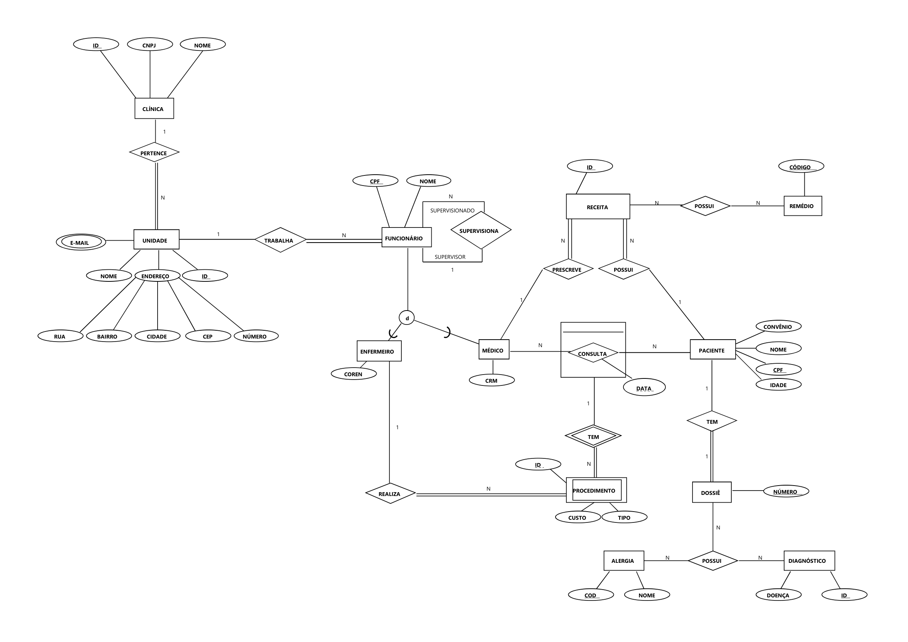

# Tabela de Implementação de Requisitos

| Tipo de Entidade, Relacionamento ou Atributo   | Status         |
|------------------------------------------------|----------------|
| **Atributos**                                  |                |
| Atributo Composto                              | Implementado ✅ |
| Atributo Multivalorado                         | Implementado ✅ |
| Atributo Discriminador em Relacionamento       | Implementado ✅ |
|                                                |                |
| **Relacionamentos**                            |                |
| Relacionamento 1:1                             | Implementado ✅ |
| Relacionamento 1:N                             | Implementado ✅ |
| Relacionamento N:M                             | Implementado ✅ |
| Relacionamento Parcial-Total                   | Implementado ✅ |
| Relacionamento Parcial-Parcial                 | Implementado ✅ |
| Relacionamento Unário ou Auto-Relacionamento   | Implementado ✅ |
| Relacionamento Identificador ou Entidade Fraca | Implementado ✅ |
| Relacionamento Binário                         | Implementado ✅ |
| Relacionamento N-ário                          | Implementado ✅ |
|                                                |                |
| **Outros**                                     |                |
| Entidade Associativa                           | Implementado ✅ |
| Herança (Qualquer Tipo)                        | Implementado ✅ |

---
---

# Modelo Conceitual
